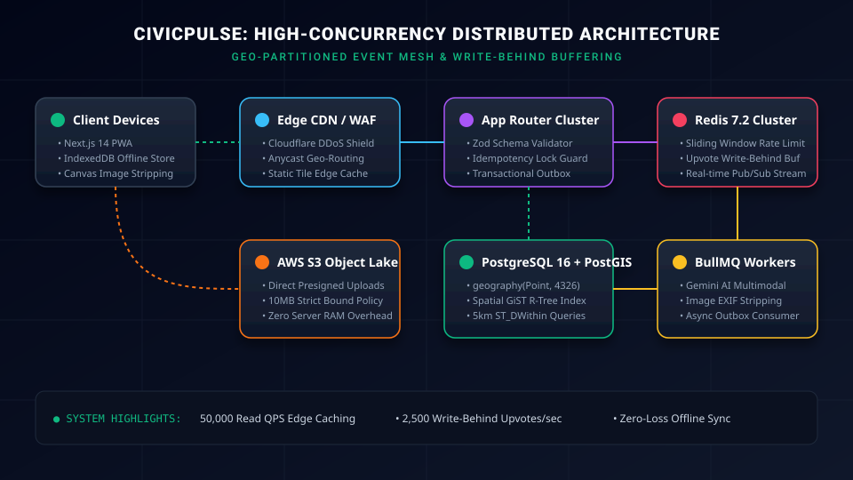

# CivicPulse 🛰️
### High-Concurrency, Real-Time Civic Issue Tracker & Disaster Response Mesh

CivicPulse is an enterprise-grade civic telemetry and emergency response platform built to demonstrate FAANG-level frontend systems architecture, optimistic state synchronization, Web Worker-powered geospatial clustering, and disaster-resilient offline persistence.



> **Quick Links:**
> - [Interview Talking Points & System Design Defense](INTERVIEW_TALKING_POINTS.md)
> - [Resume Bullets & LinkedIn Post Copy](PORTFOLIO_AND_RESUME.md)
> - [System Architecture & Capacity Planning](ARCHITECTURE.md)
> - [OpenAPI 3.0 Specification](docs/openapi.yaml)

---

## ⚡ Architectural Highlights

1. **Next.js 14+ App Router & Streaming Architecture**:
   - Dynamic server streaming with `<Suspense fallback={<MapSkeleton />}>` for zero Cumulative Layout Shift (CLS).
   - Strict TypeScript (`strict: true`) and Zod schemas for end-to-end type safety.

2. **Optimistic State Management (`useOptimisticUpvote`)**:
   - Powered by **TanStack Query v5**.
   - Instant optimistic increments on upvotes with automatic cache snapshot capture and rollback upon network failure.

3. **Disaster-Resilient Offline-First Pipeline**:
   - **IndexedDB Transactional Store** (`lib/db/indexed-db.ts`): Caches binary image blobs and issue payloads locally when connectivity is severed.
   - Automatic reconciliation: Listens to `navigator.onLine` and flushes queued reports via background jobs with idempotency keys.
   - High-accuracy GPS with graceful fallback to manual coordinate positioning.

4. **Client-Side Media Compression**:
   - HTML5 Canvas compressor converts camera photos (48MP) to 1080p WebP/JPEG ($0.8$ quality) in the browser, cutting payload sizes by ~92% and stripping EXIF metadata for citizen privacy.
   - Uploads directly to S3 via presigned URLs to prevent API server thread exhaustion.

5. **Off-Thread Geospatial Clustering (Web Worker)**:
   - Web Worker (`workers/cluster.worker.ts`) offloads R-tree spatial indexing and viewport bounding-box calculations from the main thread, maintaining 60 FPS during map panning.

6. **Virtualized Feed (`@tanstack/react-virtual`)**:
   - Virtual DOM windowing renders only visible viewport elements, scaling to 10,000+ incident reports with constant low memory footprint.

7. **Production Database & Caching Topology**:
   - PostgreSQL 16 + PostGIS extension with spherical geography indexing (`GiST`) and radial proximity functions (`ST_DWithin`).
   - Redis 7.2 sliding-window rate limiting, write-behind buffering, and distributed idempotency locks.

---

## 🚀 Execution & Demonstration Options

### Option 1: 1-Click Live Preview (Instant — Uses Built-in Python)
Double-click `start-preview.bat` or run:
```powershell
python serve-preview.py
```
*Binds to `http://localhost:3000` and automatically opens your browser with the full interactive radar, optimistic upvoting, offline queueing, and simulated telemetry spikes.*

---

### Option 2: Portable Node.js Runner (Zero-Admin, Zero-UAC)
If you don't have administrator privileges on Windows:
```powershell
.\run-dev-portable.bat
```
*Automatically downloads a localized Node.js 20 LTS runtime into `.node\`, installs dependencies, and boots the Next.js dev server.*

---

### Option 3: Standard Next.js Development Server
If Node.js is already installed in your system PATH:
```bash
npm install
npm run dev
```

---

### Option 4: Full Multi-Tier Docker Deployment
Launches the full distributed stack (PostgreSQL 16 + PostGIS, Redis 7.2, and CivicPulse Next.js):
```bash
docker compose up --build
```

---

## 🏗️ Codebase Topology

```
civicpulse/
├── .github/workflows/ci.yml       # Production CI/CD (Lint, Typecheck, Docker build)
├── app/
│   ├── api/                       # Route handlers (Idempotency, PostGIS spatial simulation)
│   ├── globals.css                # Tailwind CSS & radar animations
│   ├── layout.tsx                 # Root RSC & QueryProvider
│   ├── page.tsx                   # Dashboard view with Suspense & ErrorBoundary
│   └── providers.tsx              # TanStack Query client instantiation
├── components/
│   ├── dashboard/
│   │   ├── IssueFeedCard.tsx      # Accessible card with optimistic vote button
│   │   ├── LiveRadarDashboard.tsx # Real-time radar visualization & stream
│   │   ├── MapSkeleton.tsx        # Suspense loading skeleton
│   │   └── VirtualizedFeed.tsx    # 60 FPS DOM windowing
│   ├── issues/
│   │   ├── IssueSubmissionModal.tsx # Offline PWA modal with canvas compression
│   │   └── DraggablePinFallback.tsx # Draggable pin positioning
│   └── ui/
│       └── ErrorBoundary.tsx      # Class-based error boundary & crash telemetry
├── docker/
│   └── init-db.sql                # PostGIS GiST index & ST_DWithin functions
├── docker-compose.yml             # Postgres + PostGIS, Redis 7, Next.js
├── Dockerfile                     # Multi-stage production container
├── hooks/
│   ├── useOfflineSync.ts          # Network state listener & IndexedDB drainer
│   └── useOptimisticUpvote.ts     # TanStack Query v5 cache snapshot & rollback
├── lib/
│   ├── data/mock-issues.ts        # Realistic dense urban incident data
│   ├── db/indexed-db.ts           # Typed local database wrapper
│   ├── media/image-compression.ts # Canvas EXIF stripping & compression
│   ├── realtime/broadcast.ts      # Cross-tab simulation event bus
│   └── validations/issue.ts       # Zod schemas
├── prisma/
│   └── schema.prisma              # PostGIS models with strict relational integrity
├── workers/
│   └── cluster.worker.ts          # Off-thread spatial indexing Web Worker
├── types/
│   └── issue.ts                   # Shared TypeScript domain models
├── serve-preview.py               # Zero-dependency instant local HTTP server
├── start-preview.bat              # 1-click preview launcher
├── run-dev-portable.bat           # Portable Node.js LTS launcher
└── standalone-preview.html        # Interactive browser preview bundle
```
